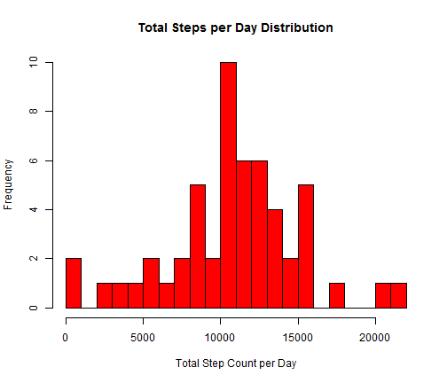
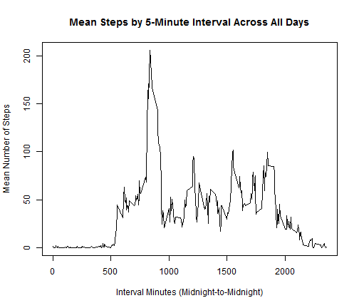
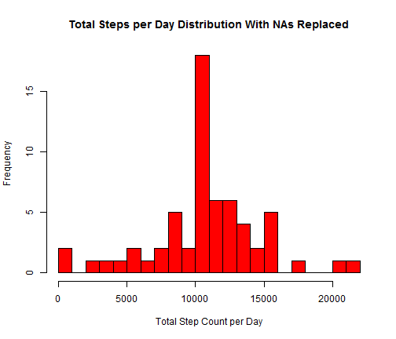
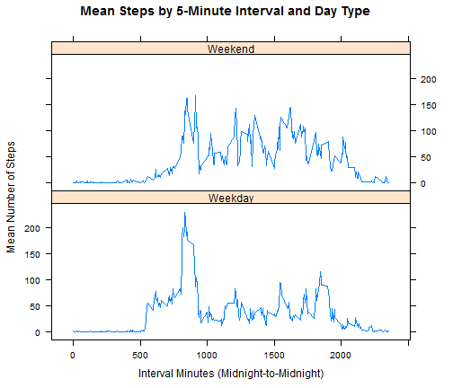

Reproducible Research: Peer Assessment 1
========================================================
### Author:  Steve Grunert  
### Created: 12 February, 2015  

## Loading and preprocessing the data.


```r
## Get source data and parse into a complete rows table and an NA rows table.

sourceData   <- read.csv("activity.csv",stringsAsFactors = FALSE) #Source data.
completeRows <- sourceData[!is.na(sourceData$steps),] #Minus NAs.
naRows       <- sourceData[is.na(sourceData$steps),] #All NAs.
```


## What is the mean total number of steps taken per day?

#### Histogram of Total Steps per Day.

```r
## Aggregate total steps per day with data minus NAs.
daySum <- aggregate(completeRows$steps
                    , by=list(Day=completeRows$date)
                    , FUN=sum)

names(daySum) <- c("day","totalsteps")


##Make histogram of total steps per day.
with(daySum,hist(as.numeric(daySum$totalsteps )
                    , breaks = 20
                    , col = "red"
                    , main = "Total Steps per Day Distribution"
                    , xlab = "Total Step Count per Day"
                    , ylab = "Frequency"))
```

 

#### Mean and Median of Total Steps per Day.

```r
## Create table with total step mean and median.
library(xtable)

a1   <- mean(daySum$totalsteps)
b1   <- median(daySum$totalsteps)
df1  <- data.frame(Mean = a1)
df1$Median <- b1
xt1  <- xtable(df1)
 
print(xt1,type='html')
```

<!-- html table generated in R 3.1.2 by xtable 1.7-4 package -->
<!-- Fri Feb 13 20:25:28 2015 -->
<table border=1>
<tr> <th>  </th> <th> Mean </th> <th> Median </th>  </tr>
  <tr> <td align="right"> 1 </td> <td align="right"> 10766.19 </td> <td align="right"> 10765 </td> </tr>
   </table>


## What is the average daily activity pattern?

#### Graph of Mean Steps per 5-Minute Interval Across All Days.

```r
## Aggregate mean steps per interval with data minus NAs.
intervalMean <- aggregate(completeRows$steps
                    , by=list(Interval=completeRows$interval)
                    , FUN=mean)

names(intervalMean) <- c("interval","meansteps")


## Make line plot of mean steps by interval.
with(intervalMean, plot(intervalMean$interval
                    , as.numeric(intervalMean$meansteps)
                    , type = "l"
                    , main = "Mean Steps by 5-Minute Interval Across All Days"
                    , ylab = "Mean Number of Steps"
                    , xlab = "Interval Minutes (Midnight-to-Midnight)"))
```

 

#### 5-Minute Interval with the Peak Mean.

```r
## Create table with peak interval.
maxMean <- max(intervalMean$meansteps)
maxRow  <- intervalMean[intervalMean$meansteps == maxMean,]
df2     <-data.frame(PeakInterval = maxRow$interval)
xt2     <- xtable(df2)

print(xt2,type='html')
```

<!-- html table generated in R 3.1.2 by xtable 1.7-4 package -->
<!-- Fri Feb 13 20:25:28 2015 -->
<table border=1>
<tr> <th>  </th> <th> PeakInterval </th>  </tr>
  <tr> <td align="right"> 1 </td> <td align="right"> 835 </td> </tr>
   </table>


## Inputting missing values.

#### Count of NA Rows.

```r
## Create table with NA row count.
df3 <-data.frame(NARowCount = nrow(naRows))
xt3 <- xtable(df3)

print(xt3,type='html')
```

<!-- html table generated in R 3.1.2 by xtable 1.7-4 package -->
<!-- Fri Feb 13 20:25:28 2015 -->
<table border=1>
<tr> <th>  </th> <th> NARowCount </th>  </tr>
  <tr> <td align="right"> 1 </td> <td align="right"> 2304 </td> </tr>
   </table>
  
#### Replacing NAs with Mean per Corresponding 5-Minute Interval.
#### Process Steps:
1. Join the NA table rows to the interval mean rows by interval id.
2. Overwrite the NAs with the corresponding mean value.
3. Remove extra columns.
4. rbind the updated NA rows to the original non-NA rows.


```r
## Merge NA rows with interval means to replace NAs
library(plyr)
mergedRows <- arrange(join(naRows,intervalMean), interval) # Merge.
```

```
## Joining by: interval
```

```r
mergedRows$steps <- mergedRows$meansteps # Replace NAs.
mergedRows$meansteps <- NULL # Remove unneeded column.
mergedRows$intervalcount <- NULL # Remove unneeded column.

## Combine updated NA rows with the original non-NA rows.
updatedRows <- rbind(completeRows,mergedRows)
```

#### Recreate Histogram of Total Steps per Day with Replace NAs.

```r
## Aggregate total steps per day with all data and NAs replaced.
updateddaySum <- aggregate(updatedRows$steps
                    , by=list(Day=updatedRows$date)
                    , FUN=sum)

names(updateddaySum) <- c("day","totalsteps")


##Make an updated histogram of total steps per day.
with(updateddaySum,hist(as.numeric(updateddaySum$totalsteps )
                    , breaks = 20
                    , col = "red"
                    , main = "Total Steps per Day Distribution With NAs Replaced"
                    , xlab = "Total Step Count per Day"
                    , ylab = "Frequency"))
```

 
#### Recreate Mean and Median of Total Steps per Day with NAs Replaced.

```r
## Recreate table with Mean and Median
library(xtable)

a4  <- mean(updateddaySum$totalsteps)
b4  <- median(updateddaySum$totalsteps)
df4 <- data.frame(Mean = a4)
df4$Median <- b4
xt4 <- xtable(df4)

print(xt4,type='html')
```

<!-- html table generated in R 3.1.2 by xtable 1.7-4 package -->
<!-- Fri Feb 13 20:25:29 2015 -->
<table border=1>
<tr> <th>  </th> <th> Mean </th> <th> Median </th>  </tr>
  <tr> <td align="right"> 1 </td> <td align="right"> 10766.19 </td> <td align="right"> 10766.19 </td> </tr>
   </table>


## Are there differences in activity patterns between weekdays and weekends?

#### Adding a Weekday/Weekend Factor column.
#### Process Steps:
1. Convert the date column to a new weekday name column.
2. Generate a table to translate a weekday name to weekday/weekend factors.
3. Join the data table rows to the translation table based on weekday name.


```r
## Add day of week column to the updated rows.
updatedRows$dayofweek <- weekdays(as.Date(updatedRows$date, format = "%Y-%m-%d"))

## Create a daytype translation table.
m  <- c("Monday", "Weekday")
tu <- c("Tuesday", "Weekday")
w  <- c("Wednesday", "Weekday")
th <- c("Thursday", "Weekday")
f  <- c("Friday", "Weekday")
sa <- c("Saturday", "Weekend")
su <- c("Sunday", "Weekend")
dayKey <- data.frame(rbind(m,tu,w,th,f,sa,su))
names(dayKey) <- c("dayofweek","daytype")


## Merge updated data with the translation table.
library(plyr)
datetypeRows <- arrange(join(updatedRows,dayKey), dayofweek)
```

```
## Joining by: dayofweek
```

#### Graph of Mean Steps per 5-Minute Interval Split by Weekday/Weekend Factor.

```r
## Aggregate the mean steps by interval and daytype.
datetypeMean <- aggregate(datetypeRows$steps
                    , by=list(datetypeRows$interval
                    , datetypeRows$daytype)
                    , FUN=mean)
names(datetypeMean) <- c("interval","daytype", "meansteps")


## Make line plot panel of mean steps by interval split by daytype factor.
library(lattice)
xyplot(meansteps~interval|daytype,data = datetypeMean
                    , main = "Mean Steps by 5-Minute Interval and Day Type"
                    , xlab = "Interval Minutes (Midnight-to-Midnight)"
                    , ylab = "Mean Number of Steps"
                    , type = "l"
                    , layout= c(1,2))
```

 
